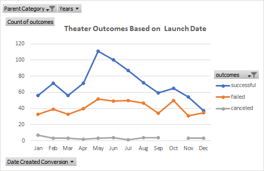
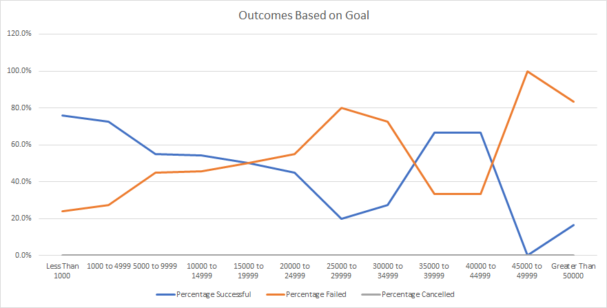

# Kickstarting with Excel

## Overview of Project

### Purpose
  Use Excel to analyze data, looking at the outcomes (success, failure, or cancellation) across certain Kickstarter campaigns with respect to goal funding and launch date.  This analysis will be used to inform on an ongoing Kickstarter campaign for the play *Fever*.

## Analysis and Challenges

### Analysis of Outcomes Based on Launch Date
  Here, we use a line graph to visualize the performance of Kickstarter theater campaigns based upon when the campaigns began.  We took Kickstarter campaign data, filtered it to isolate those involving theater, and used this subset to create a pivot table describing number of outcomes against month of launch date.  

### Analysis of Outcomes Based on Goals
  Here, we use a line graph to visualize the performance of Kickstarter campaigns for plays based on goal funding.  This data was filtered to isolate campaigns involving plays.  Outcomes were then counted according to the amount of money each campaign asked for.  These outcomes were then converted to percentages to visualize relative success against goal funding.

### Challenges and Difficulties Encountered
  As the number of factors and analyses increase, the data set and workbook become more and more unwieldy.  Large data sets are more difficult to navigate and to work with.
  Some errors came up, easily solved by accounting for dividing by 0.
  Errors again when trying to expand a formula against a data set after( vs. before) filtering or sorting.
  

## Results
  We can tell from the Outcomes vs. Launch graph two things:
One, Kickstarter campaigns for theater projects seem to succeed more often than fail throughout the year.
And two, the most favorable month to begin a campaign- that is the month which seems to enjoy the most success in theater kickstarters- is May.
  In addition, we can tell from the Outcomes vs. Launch Date graph that, with some exception, a larger percentage of play campaigns succeeded rather than failed when asking for under $20,000.  In fact, this percentage gap becomes increasingly larger with smaller goals.
  It is important to note, however, that the currency should be standardized to value.  If half of the data for our Outcomes vs Goals graph was actually in british pounds, many of those data points likely ended up in the wrong dollar range, for example.  The campaigns should be adjusted to a single currency, if they are not already.
  Other factors we have not considered, yet:
    -length (i.e. duration) of campaign
    -advertisement (staff pick and/or spotlight campaigns);
  It would be interesting to see a graph visualizing the difference between the campaign launch and deadline against percent funded.  Maybe longer campaigns are more likely to find backers.  I suppose a scatter plot could be helpful in identifying a pattern, if any. And I would hypothesize that campaigns that enjoyed both staff pick and spotlight attention would garner more support than those which enjoyed one or neither.  I would be interested to see a bar graph depicting the outcome of campaigns against number ranges of backers with 2, 1, or 0 endorsements.
